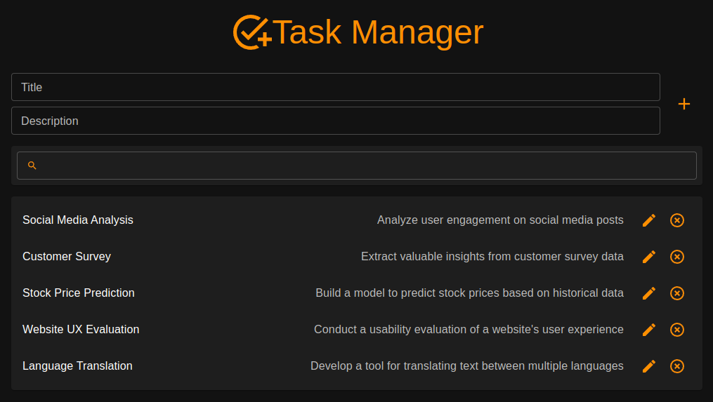

# ✅ Task Manager

<p align="center">
  <a href="#-description">Description</a>&nbsp;|&nbsp;
  <a href="#-deploy">Deploy</a>&nbsp;|&nbsp;
  <a href="#-how-to-use">How To Use</a>&nbsp;|&nbsp;
  <a href="#-tech-stack">Tech Stack</a>&nbsp;|&nbsp;
  <a href="#-structure">Structure</a>&nbsp;|&nbsp;
  <a href="#-api-endpoints">API Endpoints</a>&nbsp;|&nbsp;
  <a href="#-model">Model</a>&nbsp;|&nbsp;
  <a href="#-environment-variables">Environment Variables</a>&nbsp;|&nbsp;
  <a href="#-install-and-local-development">Installing and Local Development</a>&nbsp;|&nbsp;
</p>

<br>

<p align="center">
  
</p>


## 📙 Description

Task Manager is a user-friendly task manager app that helps you create, edit, remove, and search tasks effortlessly. Store all your tasks in a database for easy access across devices. Stay organized, increase productivity, and achieve your goals with Task Manager!


## 💻 Deploy

- [Click here](https://task-manager-nicolasbrandao.vercel.app/) to go the live demo


## ⚙️ How To Use

- Create a new task:
  - Create a new task by just filling up the input forms `Title` and `Description` and clicking on the `+` button
  - Title and Description are required
  - Title has maximum characters limit of 22 and description of 80
- Edit an existing task
  - Edit tasks by clink on the pencil icon and changing the fields
  - Save the changes to the DB clicking on save
- Remove an existing task
  - Simply click on the remove icon to remove a task
- Search tasks by title matching
  - Search for a task by just typing your query into the searching field
  - The search is done by matching the query and tasks titles


## 🛠 Tech Stack

**Front-end:**
- Vite
    - React
        - Redux & Redux Toolkit
        - React Hook Form
        - React Router DOM
        - Zod
        - Lodash
            - Debounce
        - Material UI

**Back-end:**
- [AceBase](https://github.com/appy-one/acebase)
- Express.js
    - Zod

*All the application was developed with TypeScript*


## 🧩 Structure
<p align="center">
  
</p>


## 📡 API Endpoins
### GET /tasks/
Retrieves a list of tasks based on the provided query parameter.

#### Request:

- Method: GET
- Path: /tasks/
- Query Parameters:
`q (optional): Search query for filtering tasks. Defaults to an empty string.`

#### Response:

- Status Code: 200 (OK)
- Response Body: An array of task objects.

### POST /tasks/
Creates a new task.

#### Request:

- Method: POST
- Path: /tasks/
- Request Body (JSON):
```
{
  "title": "Task Title",
  "description": "Task Description"
}
```
`title (string): Title of the task (1 to 22 characters).`

`description (string): Description of the task (1 to 80 characters).`
#### Response:

- Status Code: 201 (Created) if successful, 400 (Bad Request) if request body validation fails.
- Response Body: None (empty response body on success).

### DELETE /tasks/:id
Deletes a task based on its ID.

#### Request:

- Method: DELETE
- Path: /tasks/:id
- URL Parameters:
`id (string): ID of the task to be deleted.`
#### Response:

- Status Code: 201 (Created) if successful.
- Response Body: None (empty response body).
### PUT /tasks/:id
Updates a task based on its ID.

#### Request:

- Method: PUT
- Path: /tasks/:id
- URL Parameters:
`id (string): ID of the task to be updated.`
- Request Body (JSON):


```
{
  "title": "Updated Task Title",
  "description": "Updated Task Description"
}
```

`title (string, optional): Updated title of the task (1 to 22 characters).`

`description (string, optional): Updated description of the task (1 to 80 characters).`

#### Response:

Status Code: 201 (Created) if successful, 400 (Bad Request) if request body validation fails.
Response Body: None (empty response body on success).

## Model
The TaskDAO class provides methods for interacting with task data in a consistent and organized manner. It serves as the Model component in the Model-View-Controller (MVC) architecture for the project. This class allows you to manage tasks stored in the database with clear CRUD (Create, Read, Update, Delete) operations.

### Create `create(task)`
Creates a new task in the database.

`task (object): An object representing the task to be created. It should contain title (string) and description (string) properties.`
- Usage
```
const newTask = {
  title: "Task Title",
  description: "Task Description",
};

await task.create(newTask);
```
### Search `search(searchTerm)`
Searches for tasks in the database that match the provided search term and returns an array of tasks that match the search criteria.

`searchTerm (string): The search term to be used for filtering tasks.`

- Usage
```
const searchTerm = "search term";
const searchResults = await task.search(searchTerm);
```

### Update `update(updatedTask)`
Updates an existing task in the database.

`updatedTask (object): An object representing the updated task. It should contain id (string), title (string), and description (string) properties.`

- Usage
```
const updatedTask = {
  id: "task-id",
  title: "Updated Task Title",
  description: "Updated Task Description",
};

await task.update(updatedTask);
```

### Delete `delete(id)`
Deletes a task from the database.

`id (string): The ID of the task to be deleted.`
- Usage
```
const taskIdToDelete = "task-id-to-delete";
await task.delete(taskIdToDelete);
```

## 🔢 Environment Variables

This web app has only one Environment Variable. Create a `.env` file at the root of `/frontend` with the following var:

**Front-end(.env)**
```bash
    VITE_TASKS_BASE_URL
```

This is the API base URL of your backend. For example `http://mybackend.com/tasks`

## 👨‍💻 Installing and Local Development

Download and setup the environment variable in a ```.env``` (see <a href="#-environment-variables">Environment Variables</a>)

*Examples with PNPM*

**Go to the backend folder:**

Install dependecies:

```bash
  pnpm install
```

Run local server:
```bash
  pnpm dev
```

Format files with ESLint:
```bash
  pnpm format
```

**Go to the frontend folder:**

Install dependecies:

```bash
  pnpm install
```

Run local server:
```bash
  pnpm dev
```

Format files with ESLint:
```bash
  pnpm format
```
