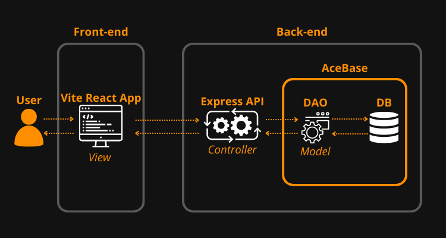

# ✅ Task Manager

<p align="center">
  
</p>


## 📙 Description

Task Manager is a user-friendly task manager app that helps you create, edit, remove, and search tasks effortlessly. Store all your tasks in a database for easy access across devices. Stay organized, increase productivity, and achieve your goals with Task Manager!


## 💻 Deploy

- [Click here](https://task-manager-nicolasbrandao.vercel.app/) to go the live demo

**Connection with the back-end might take a few seconds on the first try**


## ⚙️ Usage

- Create a new task
  - Create a new task by just filling up the input forms `Title` and `Description` and clicking on the `+` button
  - Title and Description are required
  - Title has maximum characters limit of 22 and description of 80
- Edit an existing task
  - Edit tasks by clicking on the pencil icon and changing the fields
  - Save the changes to the DB clicking on save
- Remove an existing task
  - Simply click on the remove icon to remove a task
- Search tasks
  - Search for a task by just typing your query into the searching field
  - The search is done by matching the query and tasks titles


## 🛠 Tech Stack

**Front-end:**
- Vite
    - React
        - Redux & Redux Toolkit
        - React Hook Form
        - React Router DOM
        - Zod
        - Lodash
            - Debounce
        - Material UI

**Back-end:**
- [AceBase](https://github.com/appy-one/acebase)
- Express.js
    - Zod

*All the application was developed with TypeScript*


## 🧩 Structure
<p align="center">
  
</p>

## 🧰 Redux Toolkit API `tasksApi`
The `tasksApi` is a set of Redux Toolkit API endpoints created using the `createApi` function. It provides a streamlined way to manage asynchronous data fetching and state management for tasks in the application.

### Endpoints

#### `searchTasks`

This endpoint allows you to search for tasks based on a search term.

- Method: GET
- Query Arguments:
  - `searchTerm` (optional): Search term for filtering tasks.
- URL: `/`
- Provides Tags: `["Task"]`

#### `deleteTask`
This endpoint allows you to delete a task by its ID.

- Method: DELETE
- Mutation Arguments:
  - `taskId`: ID of the task to delete.
- URL: `/${taskId}`
- Invalidates Tags: `["Task"]`

#### `createTask`
This endpoint allows you to create a new task.

Method: POST
- Mutation Arguments:
  - `task`: Task object with title and description properties.
- URL: `/`
- Invalidates Tags: `["Task"]`

#### `updateTask`
This endpoint allows you to update an existing task.

- Method: PUT
- Mutation Arguments:
  - `task`: Updated Task object with id, title, and description properties.
- URL: `/${task.id}`
- Invalidates Tags: `["Task"]`

#### Exported Hooks and Instances
The following hooks and instances are exported for use in the application:

- `useSearchTasksQuery`: Hook to fetch tasks based on search criteria.
- `useDeleteTaskMutation`: Hook to delete a task by its ID.
- `useCreateTaskMutation`: Hook to create a new task.
- `useUpdateTaskMutation`: Hook to update an existing task.
- `tasksApi`: Instance of the created tasksApi, which encapsulates all the endpoints and configuration.

#### Example Usage
```javascript
// Fetch tasks based on search term
const { data: tasks, isLoading } = useSearchTasksQuery('searchTerm');

// Delete a task
const deleteTaskMutation = useDeleteTaskMutation();
deleteTaskMutation.mutate('taskIdToDelete');

// Create a new task
const createTaskMutation = useCreateTaskMutation();
createTaskMutation.mutate({ title: 'New Task', description: 'Description' });

// Update an existing task
const updateTaskMutation = useUpdateTaskMutation();
updateTaskMutation.mutate({ id: 'taskIdToUpdate', title: 'Updated Task', description: 'Updated Description' });
```

## 📡 API
### GET `/tasks/`
Retrieves a list of tasks based on the provided query parameter.

#### Request:

- Method: GET
- Path: /tasks/
- Query Parameters:
`q (optional): Search query for filtering tasks. Defaults to an empty string.`

#### Response:

- Status Code: 200 (OK)
- Response Body: An array of task objects.

### POST `/tasks/`
Creates a new task.

#### Request:

- Method: POST
- Path: /tasks/
- Request Body (JSON):
```
{
  "title": "Task Title",
  "description": "Task Description"
}
```
`title (string): Title of the task (1 to 22 characters).`

`description (string): Description of the task (1 to 80 characters).`
#### Response:

- Status Code: 201 (Created) if successful, 400 (Bad Request) if request body validation fails.
- Response Body: None (empty response body on success).

### DELETE `/tasks/:id`
Deletes a task based on its ID.

#### Request:

- Method: DELETE
- Path: /tasks/:id
- URL Parameters:
`id (string): ID of the task to be deleted.`
#### Response:

- Status Code: 201 (Created) if successful.
- Response Body: None (empty response body).
  
### PUT `/tasks/:id`
Updates a task based on its ID.

#### Request:

- Method: PUT
- Path: /tasks/:id
- URL Parameters:
`id (string): ID of the task to be updated.`
- Request Body (JSON):


```
{
  "title": "Updated Task Title",
  "description": "Updated Task Description"
}
```

`title (string, optional): Updated title of the task (1 to 22 characters).`

`description (string, optional): Updated description of the task (1 to 80 characters).`

#### Response:

Status Code: 201 (Created) if successful, 400 (Bad Request) if request body validation fails.
Response Body: None (empty response body on success).

## 🗄️ DAO
The TaskDAO class provides methods for interacting with task data in a consistent and organized manner. It serves as the Model component in the Model-View-Controller (MVC) architecture for the project. This class allows you to manage tasks stored in the database with clear CRUD (Create, Read, Update, Delete) operations.

### Create `create(task)`
Creates a new task in the database.

`task (object): An object representing the task to be created. It should contain title (string) and description (string) properties.`
- Usage
```
const newTask = {
  title: "Task Title",
  description: "Task Description",
};

await task.create(newTask);
```
### Search `search(searchTerm)`
Searches for tasks in the database that match the provided search term and returns an array of tasks that match the search criteria.

`searchTerm (string): The search term to be used for filtering tasks.`

- Usage
```
const searchTerm = "search term";
const searchResults = await task.search(searchTerm);
```

### Update `update(updatedTask)`
Updates an existing task in the database.

`updatedTask (object): An object representing the updated task. It should contain id (string), title (string), and description (string) properties.`

- Usage
```
const updatedTask = {
  id: "task-id",
  title: "Updated Task Title",
  description: "Updated Task Description",
};

await task.update(updatedTask);
```

### Delete `delete(id)`
Deletes a task from the database.

`id (string): The ID of the task to be deleted.`
- Usage
```
const taskIdToDelete = "task-id-to-delete";
await task.delete(taskIdToDelete);
```

## 🔢 Environment Variables

This web app has only one Environment Variable. Create a `.env` file at the root of `/frontend` with the following var:

**Front-end(.env)**
```bash
    VITE_TASKS_BASE_URL
```

This is the API base URL of your backend. For example `http://mybackend.com/tasks`

## 👨‍💻 Installing and Local Development

Download and setup the environment variable in a ```.env``` (see <a href="#-environment-variables">Environment Variables</a>)

*Examples with PNPM*

**Go to the backend folder:**

Install dependecies:

```bash
  pnpm install
```

Run local server:
```bash
  pnpm dev
```

Format files with ESLint:
```bash
  pnpm format
```

**Go to the frontend folder:**

Install dependecies:

```bash
  pnpm install
```

Run local server:
```bash
  pnpm dev
```

Format files with ESLint:
```bash
  pnpm format
```

## 📈 Opportunities for Improvement

In this section you find the main opportunities for improvement on this project:

- User authentication
- Pagination
- Tasks filter
- Data validation with AceBase Schemas
- Enhance error handling on API endpoints